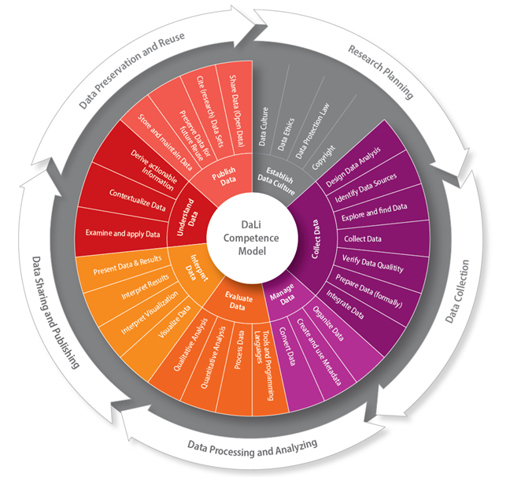

# How many times have you been checking the news? reviewing forecasting? and asking yourself... is this data correct? from where does it come?

How many times have you been following Reels on Instagram that, at the end, are fake news?

[Watch this video](https://www.youtube.com/watch?v=8ovyQZ_Z8Xs)

Under a world of rapid advancement of technology and the proliferation of digital tools and platforms, data is generated at an unprecedented rate. Understanding how to work with data is crucial for any purpose to adapt to digital transformation and stay competitive in any field or be good at it.

This learning unit goes through some basics of defining the challenges of data and what the steps are to become a data literate.

